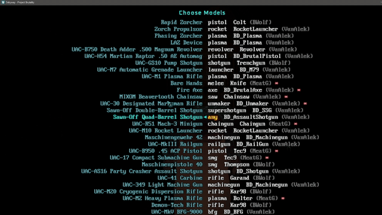
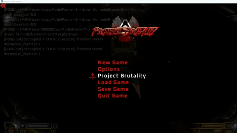

# ModelSwapper

**Their code, their damage, their sounds, their timing — these models.**

Real 3D weapons in any Doom mod. Load it alongside whatever weapon set you
already play, and the flat sprites in your hands become models. Nothing else
changes: the mod you loaded still does all the shooting.

---

## What you get

**44 models**, pulled from community weapon sets — Ermac's VanillaVR Plus,
Alek's DoomGuns, Brutal Wolfenstein 5.0, and Brutal Doom v21.

**It guesses for you.** Load a mod and every weapon gets a sensible model
straight away, worked out from its name, its ammo and its slot. Nothing is
left as a bare sprite.

**Then you overrule it.** A menu lets you set any model on any weapon. If it
guessed your shotgun is a rifle, fix it in two clicks. Want a pistol on the
BFG for some John Wick nonsense? Also two clicks.

**Your choices stick.** Preferences save between sessions, per weapon.

**The guns on the floor match.** A weapon lying in the level wears the same model
you'll be holding once you pick it up, at a size worked out from the mesh itself
rather than guessed. Some mods have pickup art worth keeping, so it's a toggle —
**Models on Floor Pickups** in the menu, on by default.

ghost model bug has been fixed!

### Or do it all in VR, without a menu

Load [RS_WeaponWheel](https://github.com/presidentkoopa/RS_WeaponWheel)
alongside and assignment moves into the game world. Open the wheel, page over
to the model view, and the ring fills with the models available for the gun in
your hand — the one you're wearing highlighted, the rest a trigger pull away.
Point, pull, it's on. The wheel stays open so you can flick through a few and
compare.

It shows that weapon's own matching models first, so a shotgun offers shotguns.
The everything-goes list is still there behind them, for when you *do* want a
boot on a chaingun.

No flat menu, no pausing, no taking the headset off. Desktop VR only — the
wheel needs the UZDXREMA engine.

---

## Does it work with my mod?

Probably. It doesn't need to know anything about a weapon set — it reads what's
loaded at runtime, so a mod released tomorrow works the same as one from 2016.

Confirmed working with Ashes 2063, Project Brutality 0.4.1, Brutal Doom v22
Test4, Abyssal Apocrypha, Golden Souls 1 & 2, DoomRL Arsenal, LEDs GNRCWPN,
DAKKA, Combined Arms, and Weapons of Saturn. Trailblazer and Guncaster should
be fine too.

Obviously not every mod ever made has been tested. If one misbehaves, the
menu's manual override is the escape hatch.

---

## Which version do I want?

| | |
| --- | --- |
| **`ModelSwapper.pk3`** | Desktop VR, on the [UZDXREMA](https://github.com/presidentkoopa/UZDXREMA) engine. **Animated** — including reload animations. |
| **`ModelSwapper-QUEST.pk3`** | Standalone Quest, on [QuestZDoom](https://github.com/emawind84/QuestZDoom) Release 17. Models are **static** — the animation needs engine features Quest doesn't have. |

Same models either way. Grab one, load it after your weapon mod, done.

---

## Digging deeper

- **[INTERNALS.md](INTERNALS.md)** — how it works, what it can't do, and why
- **[ENGINE_CHANGES.md](ENGINE_CHANGES.md)** — the engine-side changes animation needs
