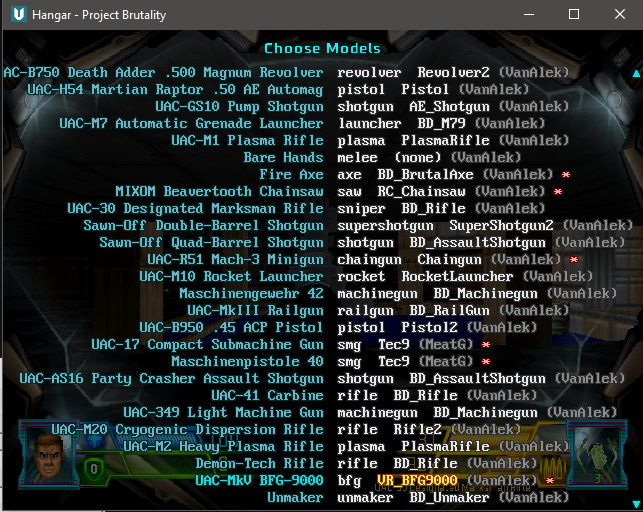
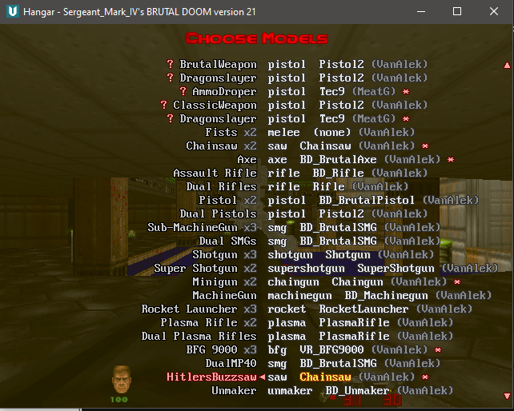
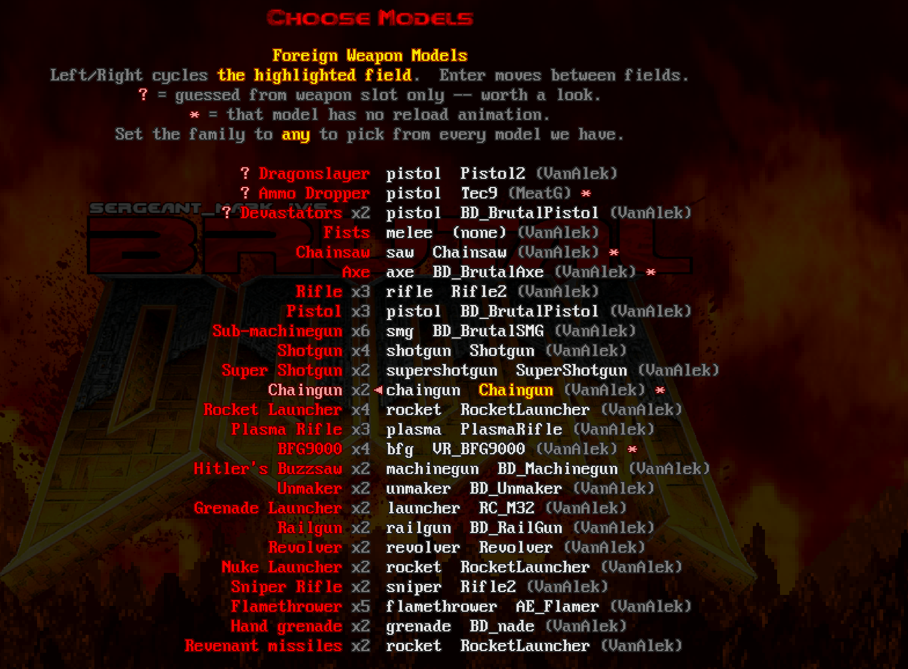
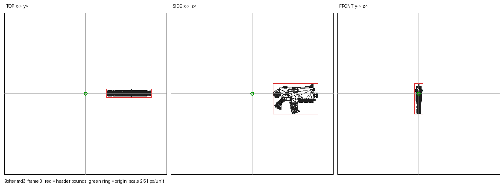
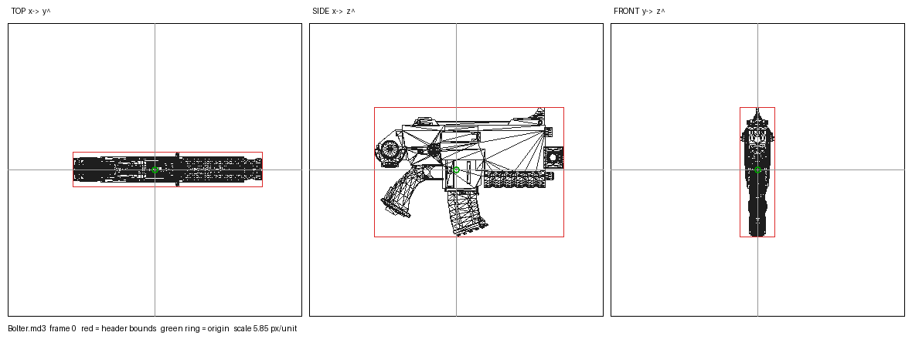
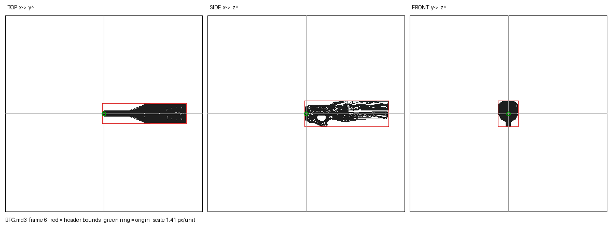
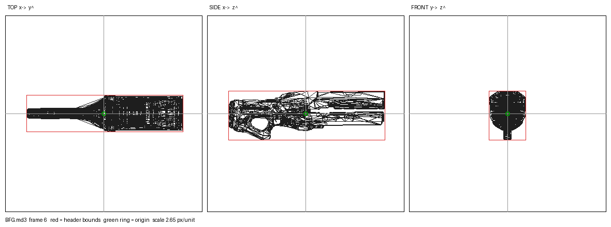

# ModelSwapper

3D weapons for any Doom mod, made for playing in VR.

The usual way to get one is for someone to hand-author a model set for a specific mod: every weapon modelled, fitted to the hand and animated to that mod's timing. That is a lot of work for a single mod, and the Doom VR community is small. Most weapon mods will never get a set of their own, including ones people love.

ModelSwapper doesn't wait for that. It carries one shelf of models and fits it to whatever you load.

Every weapon the loaded mod gives you, the family it was sorted into, and the model it is wearing. Any model can go on any weapon.

Coming in 2.0: renamed models, so every one says clearly what it is, and selectable skins, including weapons coloured to match the theme and palette of popular mods.

## How it works

ModelSwapper reads every weapon the loaded mods define and sorts each one into a family, such as pistol, shotgun, rifle or launcher. It goes by the weapon's name, its ammo and its parent class, and finally by the weapon slot it sits in, so nothing is left without a model. Each weapon then wears a model from its family.

The animation is driven by the weapon's own code. Every Doom weapon already reports what it is doing each tic through its states: ready, fire, reload, raise, lower. When a model is attached, ModelSwapper maps those states onto the model's frames, and from then on the model plays whatever the weapon is doing. A reload lasts exactly as long on the model as it does in the mod, a partial reload plays short, and the very first shot is already in time, with nothing to learn or calibrate.

Nothing in it is written for a particular mod, so a pack released tomorrow works the same way as one from 2016. It has been calibrated against the following mods:

- vanilla Doom
- Brutal Doom v21 and v22
- Brutal Doom 64, Doom 64 Unseen Evil and Doom 64 Retribution
- Project Brutality 0.4.1
- Golden Souls 1 and 2
- Ashes 2063 and Ashes Afterglow
- DoomRL Arsenal
- Guncaster
- MetaDoom
- Trailblazer
- Combined Arms
- Final Doomer
- LegenDoom Lite
- Complex Doom
- Lithium
- Dakka
- Pandemonia
- MeatGrinder
- VanillaVR Plus
- the DOOM Infinite demo

Each one's weapon code was checked against the model menu, so the menu lists the guns you can actually hold and leaves out the vehicles, meat shields, ledge grabs and other helpers a mod builds out of weapon code.

Brutal Doom, before and after that check. The rows that went are things you never hold: vehicle guns, meat shields, a ledge grab, and the base classes a mod's whole arsenal is built on.

36 models across 22 weapon families, built from 34 meshes (the rest are alternate finishes), about 30 MB in all. 

These are the renders the tools produced along the way. Each one shows top, side and front views. The green ring is the model's origin and the red box is the bounds stored in the file.

The Bolter, before and after:

The BFG, before and after:

All 35 are in renders/, and renders/sheets/ lays the before and after views side by side.

## Tools

Everything used on the models is in this repo. The scripts need Python 3, and the renderer also needs Pillow.

- tools_md3_pitch.py reads an MD3 mesh and measures the angle of every frame.
- tools_md3_reorigin.py centres a mesh on its origin and verifies the result byte by byte.
- tools_md3_compensate.py works out the position setting that keeps a centred gun exactly where it was, using a copy of the engine's own transform.
- tools_reorigin_all.py runs both over every model and stamps each model definition so a block can never be adjusted twice.
- tools_md3_render.py draws the wireframe renders shown above.
- tools_clip_audit.py shows which frames each animation uses and which frames nothing plays.
- tools_pitch_audit.py finds raise and sprint frames that swing the gun away from its resting angle.
- tools_model_inventory.py writes a full inventory of every model: frames, poses, angles and animations.
- tools_gen_pickups.ps1 generates the pickup model definitions from the meshes.
- tools_gen_bd21.ps1 generates the Brutal Doom v21 shelf from Brutal Doom's own model definitions.
- tools_zs_lint.py checks the ZScript for syntax errors before build.ps1 packs anything.
- tools_make_pb_offhand_patch.py builds a patch from your own copy of Project Brutality 0.4.1 that lets its guns work in the VR off hand. Load it after PB.

## Which build

ModelSwapper.pk3 is the desktop VR build, for [UZDXREMA](https://github.com/presidentkoopa/UZDXREMA). Models are animated, reloads included.

ModelSwapper-QUEST.pk3 is for standalone Quest, on [QuestZDoom](https://github.com/emawind84/QuestZDoom). Same models and the same picker, but the models hold still, because animation needs engine features Quest doesn't have. Fit In Hand and the muzzle flash setting are engine features too, so they do nothing there.

Load either one after your weapon mod. To build them from source, run ./build.ps1, or ./build.ps1 -Static for the Quest build.

INTERNALS.md explains the binding, classification and animation in detail, along with what they can't do. ENGINE_CHANGES.md covers the engine changes the animation needs.
