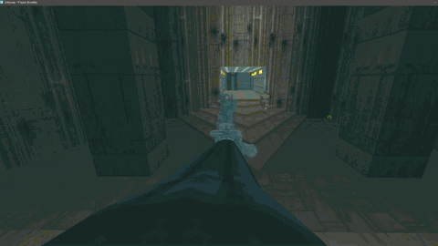

Their code, their damage, their sounds, their timing... these models.

This miracle mod does one thing: bring true, universal 3d weapons to any and all Doom mods.

Don't forget to reload your boot with your OTHER boot, lol

Big claim, and of course I haven't tested it with every mod.

Tested with:

Ashes 2063, Project Brutality 0.4.1, BD_V22 Test4, Golden Souls 1 / 2, DoomRL, LEDs GNRCWPN, DAKKA, Weapons of Saturn... (ok I'm like 80% there with projBrut but all this mod is, is modelsets and some zs so it's fkin problematic lol - i'm about to crush the phantom weapon bug you see in the PB video up there)

41? or so models pulled from community weapon sets:

Ermac's VanillaVR Plus, Alek's DoomGuns (both combined to make the VanAlek set in the mod), Brutal Wolfenstein 5.0, BrutalDoom v21.

Menu allows assignment per-weapon, per-model. Also allows options for weapon scanning if you odn't see the weapon for which you want to assign a model. Allows to assign handguns for any and all weapons, too, for some BFG and RocketBased John Wick shit lol.

Model Preferences are saved between playsessions.

REQUIRES UZDXREMA ENGINE FOR ANIMATED WEAPON MODELS - INC RELOADING ANIMATIONS ---
QUESTZDOOM VERSION TESTED AGAINST https://github.com/emawind84/QuestZDoom Release 17 ---
NEEDED ENGINE FEATURES MEANS WEAPON MODELS ARE STATIC ON QUEST

- **[INTERNALS.md](INTERNALS.md)** — how it works, what it can't do, and why
- **[ENGINE_CHANGES.md](ENGINE_CHANGES.md)** — the engine-side changes animation needs
